# SessionGuard Analyzer

A Comprehensive Burp Suite Extension for Authorization Testing & Session Security Analysis

Version 1.1.15 · Author: Denis Ivan

---
## Documentation

- Docs Index: [`docs/README.md`](docs/README.md)
- Quick Start: [`docs/quick-start.md`](docs/quick-start.md)

## Table of Contents

1. [Introduction](#introduction)
    - [What is SessionGuard Analyzer?](#what-is-sessionguard-analyzer)
    - [Key Capabilities](#key-capabilities)
    - [Why Choose SessionGuard?](#why-choose-sessionguard)
2. [Architecture & Design](#architecture--design)
    - [System Architecture](#system-architecture)
    - [Request Processing Flow](#request-processing-flow)
    - [Session Validation & Renewal Flow](#session-validation--renewal-flow)
    - [Components](#components)
3. [Installation & Setup](#installation--setup)
    - [Prerequisites](#prerequisites)
    - [Build from Source](#build-from-source)
    - [Install in Burp Suite](#install-in-burp-suite)
    - [First-Time Configuration](#first-time-configuration)
4. [Core Concepts](#core-concepts)
    - [Sessions](#sessions)
    - [Tokens & Parameters](#tokens--parameters)
    - [Extraction Methods](#extraction-methods)
    - [Replacement Mechanisms](#replacement-mechanisms)
    - [Bypass Detection](#bypass-detection)
5. [User Interface Guide](#user-interface-guide)
    - [Main Panel Overview](#main-panel-overview)
    - [Session Management Panel](#session-management-panel)
    - [Session Monitoring Panel](#session-monitoring-panel)
    - [Results Table & Analysis](#results-table--analysis)
6. [Parameter Extraction & Replacement](#parameter-extraction--replacement)
    - [Auto Extract](#auto-extract)
    - [From-To String Extraction](#from-to-string-extraction)
    - [Static Values](#static-values)
    - [Prompt for Input](#prompt-for-input)
    - [Replacement Locations](#replacement-locations)
    - [Parameter Removal](#parameter-removal)
7. [Session Monitoring & Renewal](#session-monitoring--renewal)
    - [Session Validation Configuration](#session-validation-configuration)
    - [Renewal Macros](#renewal-macros)
    - [Macro Steps & Placeholders](#macro-steps--placeholders)
    - [Validation States & Lifecycle](#validation-states--lifecycle)
    - [Failure Handling](#failure-handling)
8. [Processing & Filtering](#processing--filtering)
    - [Scope Management](#scope-management)
9. [Testing Scenarios & Use Cases](#testing-scenarios--use-cases)
10. [Advanced Features](#advanced-features)
11. [Troubleshooting & FAQ](#troubleshooting--faq)
12. [Developer Guide](#developer-guide)
13. [Appendix](#appendix)

---

## Introduction

### What is SessionGuard Analyzer?

SessionGuard Analyzer is a Burp Suite extension that discovers authorization vulnerabilities and session security issues by replicating requests across user sessions, monitoring session health, and analyzing response differences. It automates multi-role testing and reduces manual effort while keeping sessions valid via self-healing renewal macros.


### Key Capabilities

- Intelligent multi-session testing with cloning and scoping
- Automatic extraction of tokens from Set-Cookie, HTML forms, JSON
- Generic From-To extraction for custom formats (e.g., JS vars)
- Flexible request mutation (headers, cookies, params, body, path)
- Bypass detection with SAME/SIMILAR/DIFFERENT heuristics
- Scheduled session validation and self-healing via renewal macros
- Quick filters, rich diffing, and HTML/XML export for reporting

### Why Choose SessionGuard?

- Zero preflight: operates on your natural browsing traffic
- Dynamic token discovery and replacement with minimal setup
- Self-healing sessions keep long test runs reliable
- Placeholder system for macro steps: `[[tokenName]]`
- Real-time, multi-role analysis with status chips and filters

---

## Architecture & Design

### System Architecture

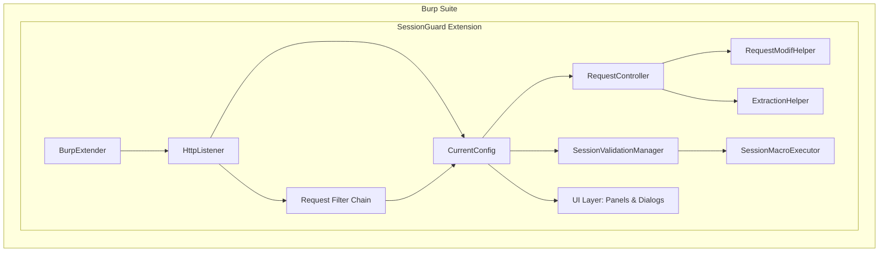

### Request Processing Flow

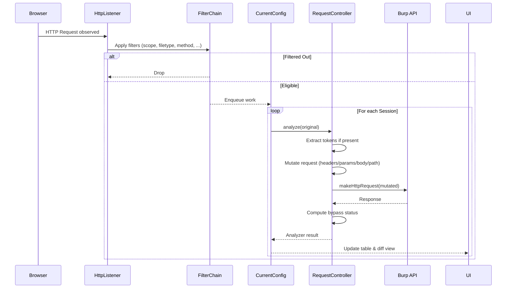

### Session Validation & Renewal Flow

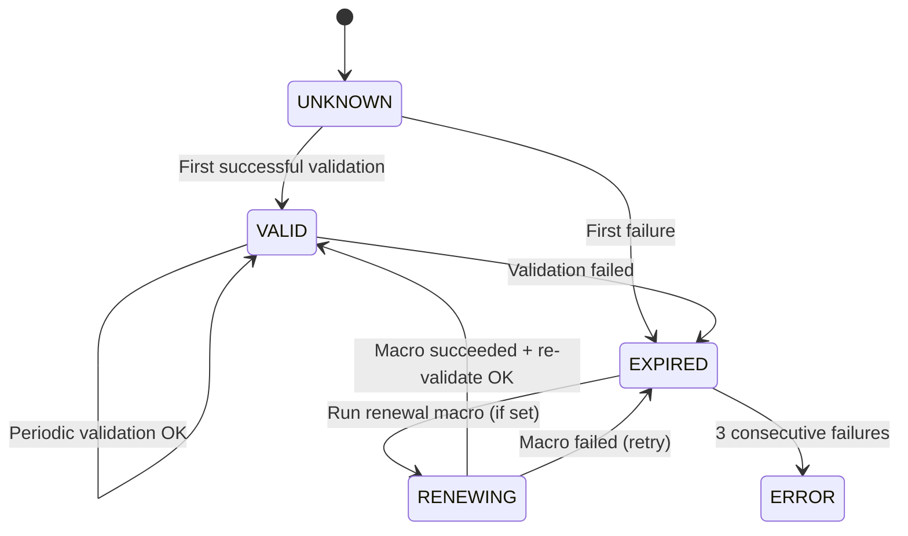

### Components

- `burp/BurpExtender`: Bootstrap; registers ITab and listeners
- `controller/HttpListener`: Intercepts proxy/http messages
- `controller/RequestController`: Core analyzer (mutations, send, analyze)
- `entities/*`: Session, Token, AnalyzerRequestResponse, ValidationConfig, RenewalMacro
- `filter/*`: InScope, OnlyProxy, FileType, Method, StatusCode, Path, Query
- `gui/main/*`: SessionPanel, SessionMonitorPanel, CenterPanel
- `util/*`: CurrentConfig, RequestModifHelper, ExtractionHelper, SessionValidationManager, SessionMacroExecutor

---

## Installation & Setup

### Prerequisites

- Burp Suite (Community or Professional)
- Java 8 runtime
- Maven 3.x

### Build from Source

```bash
cd auth-analyzer
make build    # wraps: mvn clean package
# Output: target/AuthAnalyzer-1.1.15-jar-with-dependencies.jar
```

### Install in Burp Suite

1. Burp → Extender → Extensions → Add
2. Type: Java
3. Select: `target/AuthAnalyzer-1.1.15-jar-with-dependencies.jar`
4. Confirm startup message: "SessionGuard Analyzer successfully started"

### First-Time Configuration

1. Create one session per user role (e.g., Admin, User)
2. Add session headers or cookies to replace
3. Define tokens (e.g., `SESSIONID`, `csrfToken`) and extraction methods
4. Optionally enable Session Monitoring with a validation URL
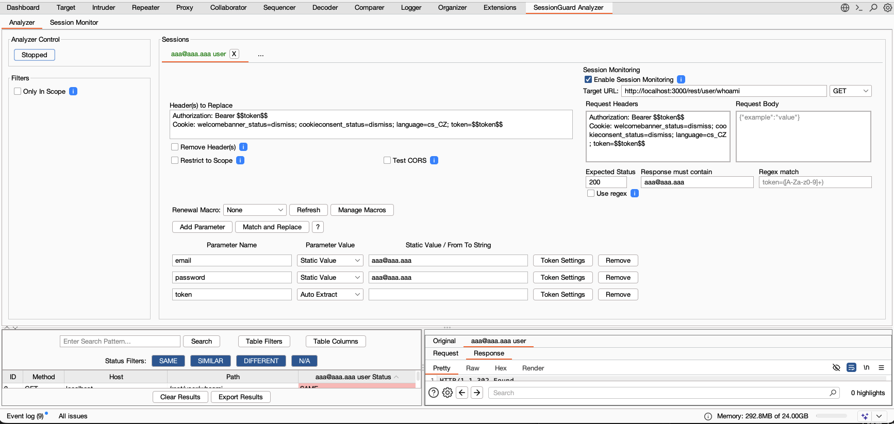
_Caption: Creating sessions, adding headers/tokens, enabling monitoring._

---

## Core Concepts

### Sessions

Represent a user role with distinct headers (cookies, authorization) and tokens. Sessions can be cloned and scoped to URLs.

### Tokens & Parameters

Define values that SessionGuard extracts from responses and injects into subsequent requests. Examples: cookies, CSRF, JWT, custom IDs.

### Extraction Methods

- Auto Extract (Set-Cookie, HTML input fields, JSON keys)
- From-To String (custom delimiters)
- Static Value (constant)
- Prompt for Input (e.g., 2FA codes)

### Replacement Mechanisms

Replace in path, query, cookies, headers, form body, or JSON body. Support for removing parameters to test negative paths.

### Bypass Detection

Heuristics classify results as:
- SAME: Bodies (and optionally status) match
- SIMILAR: Status matches and body length within threshold (±5% default)
- DIFFERENT: Everything else

---

## User Interface Guide

### Main Panel Overview


_Caption: Analyzer controls, session list, filters, and results table._

### Session Management Panel

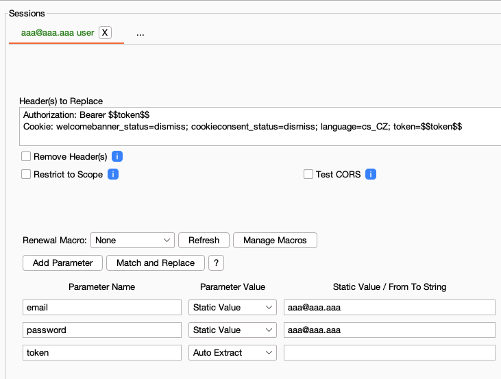
_Caption: Define headers, tokens, extraction rules, and scope._

### Session Monitoring Panel

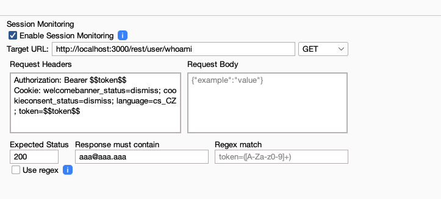
_Caption: Configure validation URL, expected status, macro selection, and view status chips._

### Results Table & Analysis

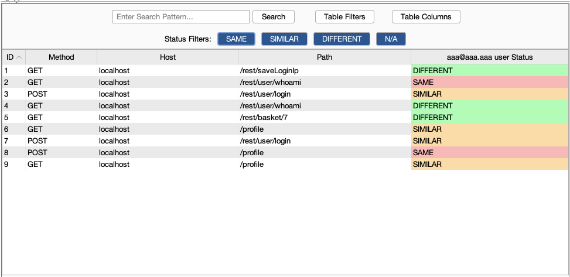
_Caption: Status (SAME/SIMILAR/DIFFERENT), filters, and export options._

---

## Parameter Extraction & Replacement

### Auto Extract

Extracts when a response contains:
- `Set-Cookie: <name>=<value>`
- HTML `<input name="<name>" value="...">`
- JSON `{ "<name>": "value" }`


_Caption: Auto extract locations configuration._

### Static Values
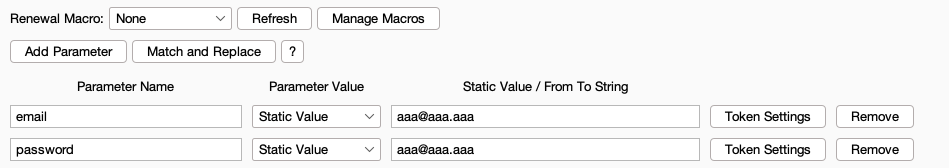
Use for constants like static CSRF tokens, usernames, etc.

### Replacement Locations

Supported insertion points:
- Path segments (e.g., `/api/user/99` → replace `99`)
- URL query parameters
- Cookies
- Form-URL-Encoded or Multipart body
- JSON body keys

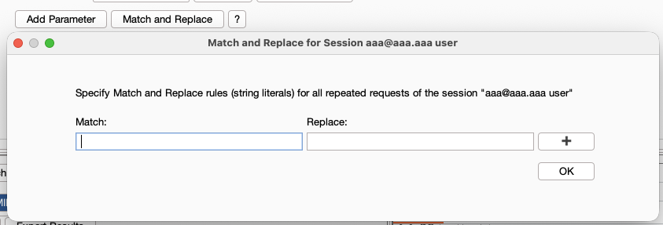
_Caption: Choose where a token should be replaced._

### Parameter Removal
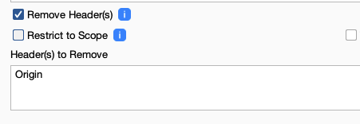
Remove selected parameters/headers.

---

## Session Monitoring & Renewal

### Session Validation Configuration
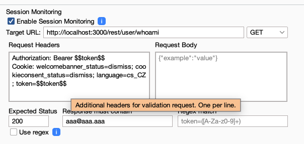
Configure a periodic health check per session:
- Method, URL, headers, body
- Success criteria: status code, body substring, or regex

### Renewal Macros
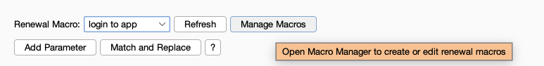
Define named, multi-step HTTP flows to renew expired sessions (e.g., login sequence). Steps can extract tokens from responses.

### Macro Steps & Placeholders

Use dynamic placeholders replaced at runtime with current token values:

```
POST /rest/user/login HTTP/1.1
Host: localhost:3000
Content-Length: 48
Connection: keep-alive

{"email":"[[email]]","password":"[[password]]"}
```

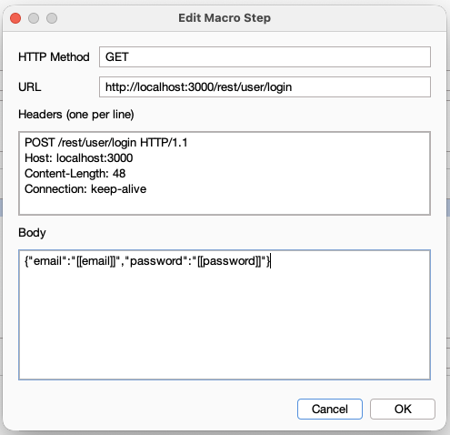
_Caption: Macro steps with headers, body, and placeholders._

### Validation States & Lifecycle

States: UNKNOWN → VALID → (EXPIRED ↔ RENEWING) → ERROR (after 3 failed renewals)

### Failure Handling

After 3 consecutive renewal failures, SessionGuard displays a dialog with the failing macro and reason, and pauses further attempts.

---

## Testing Scenarios & Use Cases

- Auto extract session cookie during login and reuse across requests
- Session header + CSRF token handling with auto-extract
- Extract token from JavaScript variable via From-To
- Auto extract and insert `Bearer` tokens in `Authorization` header
- Test several roles in parallel by cloning sessions
- Refresh auto-extracted values via Renew or by replaying a request
- Test idempotent operations by dropping original requests
- Test anonymous sessions by removing auth headers
- Validate CORS by adding `Origin` and switching to `OPTIONS`
- Test CSRF protections by removing token parameters
- Verify bypass status via Compare and Diff views

---
## Advanced Features

- Concurrency control via thread pool (auto-serializes when prompting for input)
- Tunable similarity threshold for SIMILAR classification
- Export results as HTML or XML for reporting
- Auto-save configuration; load/save setups to file

---
## Troubleshooting & FAQ

**Validation fails immediately**  
Check URL, status/regex criteria, and session headers.

**Renewal macro does not refresh tokens**  
Verify step URLs, headers, body; ensure placeholders map to defined tokens; check Burp Extender Output for errors.

**Bypass statuses look unexpected**  
Adjust similarity threshold; compare responses via Diff to understand differences.

**Prompt for Input blocks concurrency**  
This is by design when prompts are active. Disable prompting or pre-populate values.

**No results appear**  
Confirm filters (scope/method/filetype) don’t exclude traffic; ensure you are browsing through Burp.

---

## Developer Guide

- Entry point: `src/burp/BurpExtender.java`
- Core flow: `controller/HttpListener` → `util/CurrentConfig.performAuthAnalyzerRequest(...)` → `controller/RequestController.analyze(...)`
- Add new filters under `filter/` and register via `CurrentConfig`
- Extend `ExtractionHelper` for new token sources
- Modify `RequestModifHelper` for new insertion points
- Bypass heuristics in `RequestController.analyzeResponse(...)`
- Session monitoring: `SessionValidationManager` + `SessionMacroExecutor`


---
## Appendix

### Feature List

- Session creation, renaming, removal, and cloning
- Unlimited headers to replace/add; headers to remove
- Unlimited parameters to replace with multiple extraction methods
- Parameter removal for negative testing
- Detailed per-session status panel with validation/renewal
- Request replay via context menu
- Table filters, search, and export
- Start/Stop controls for the analyzer
- Scope restriction and duplicate header filtering
- Auto-save, load/save configuration

### Keyboard Shortcuts ( #todo )

- Start/Stop Analyzer: `Cmd/Ctrl + R`
- Toggle Filters: `Cmd/Ctrl + F`
- Show Diff View: `Cmd/Ctrl + D`
- Export Results: `Cmd/Ctrl + E`

### Configuration File Format

Configurations are persisted via the built-in storage provider. Exported files include sessions, headers, tokens, and monitoring settings. See `util/DataStorageProvider` for details.

---
## Quick Start: Session Monitoring & Renewal

This example demonstrates setting up automatic session validation and renewal for a typical authenticated web application.

### Prerequisites
- Burp Suite with Auth Analyzer extension loaded
- A target application with login functionality
- Session cookies or authentication tokens that can expire

### Step 1: Create a Session
1. In the **Auth Analyzer** tab, click **Add Session** (the "+" icon)
2. Name your session (e.g., "Low Privilege User")
3. In **Header(s) to Replace**, add the session cookie header:
   ```
   Cookie: SESSIONID=placeholder
   ```
4. Add a parameter for automatic token extraction:
   - **Parameter Name**: `SESSIONID`
   - **Extraction Method**: `Auto Extract`
   - **Extract Location**: `Set-Cookie Header` (click settings icon to configure)
   - **Replace Location**: `Cookie Parameter`

### Step 2: Configure Session Monitoring
1. Click the **Session Monitoring** button in your session panel
2. Fill in the validation configuration:
   - **Enable Session Monitoring**: ✓ (checked)
   - **Target URL**: `https://target.app/health` (or any authenticated endpoint)
   - **Request Method**: `GET`
   - **Expected Status**: `200`
   - **Response must contain**: `success` (or use regex)
3. Leave **Renewal Macro** as "None" for now (we'll create it next)

### Step 3: Create a Renewal Macro
1. Navigate to the **Session Monitor** tab
2. In the **Renewal Macros** tab, click **Add Macro**
3. Configure the macro:
   - **Name**: `Login Flow`
   - **Description**: `Performs login and obtains fresh session`
4. Click **Add Step** and configure the login request:
   - **Method**: `POST`
   - **URL**: `https://target.app/login`
   - **Headers**:
     ```
     Content-Type: application/x-www-form-urlencoded
     ```
   - **Body**:
     ```
     username=testuser&password=testpass123
     ```
5. Click **Save Step**, then **Save Macro**

### Step 4: Link Macro to Session
1. Return to the **Analyzer** tab
2. Click **Session Monitoring** on your session again
3. In the **Renewal Macro** dropdown, select `Login Flow`
4. Click **Save**

### Step 5: Test the Setup
1. Start the Auth Analyzer (click **▶ Start**)
2. Browse the target application with a high-privilege user in your browser
3. Watch the **Session Monitor** → **Session Status** tab:
   - Validation checks run every 60 seconds
   - Status shows `VALID`, `EXPIRED`, `ERROR`, or `UNKNOWN`
   - Last check time and message are displayed
4. To simulate expiration:
   - Manually invalidate the session cookie in your browser
   - Wait for the next validation check
   - Watch the macro execute automatically and renew the session

### Step 6: Analyze Results
1. In the **Analyzer** tab, view the request/response table
2. Filter by bypass status:
   - **SAME**: Response identical to original (potential bypass)
   - **SIMILAR**: Response similar in size/status (investigate)
   - **DIFFERENT**: Access denied (expected)
3. Use **Compare View** and **Show Diff** to analyze differences
4. Export results to HTML/XML for reporting

### Advanced: Using Placeholders in Macros
For dynamic values in renewal macros, use placeholders:
- `[[tokenName]]`: Replaced with current token value
- Example in macro body: `&user=[[username]]`
- Tokens must be defined in the session's parameter list

### Troubleshooting
- **Validation fails immediately**: Check target URL, expected status, and response criteria
- **Macro doesn't renew**: Verify macro steps (URL, headers, body), check Burp's Output tab for errors
- **After 3 failures**: A dialog appears; fix the macro or validation config and restart the analyzer
